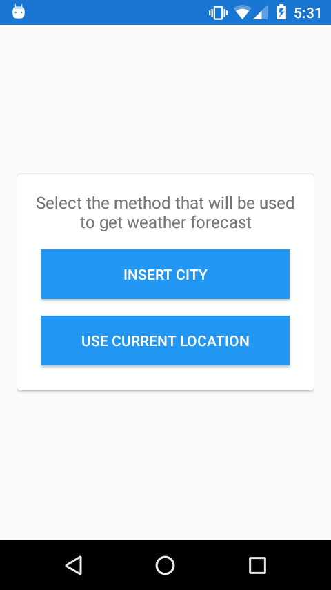
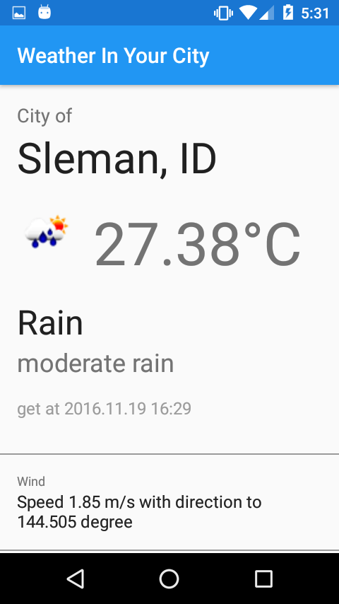

# Simple Weather Android App

This is a simple Android project for forecasting weather. The app provides 2 options to do weather forecast, 
by inserting city name, or by using user's current location.
 

## Libraries

In this project, I use some popular libraries to reduce line of codes, improve readability, improve code quality,
and more advantages that the libraries have offered. Here are some of the libraries.

- Android Support Libraries
- RxJava and RxAndroid
- Retrofit 2
- Butterknife
- Timber
- Glide
- Gson
- Easypermissions

## Requirements

- JDK 8
- Android SDK
- Android N (API 25)

### Footnote

This project cloned [SimpleBoilerplateAndroid](https://github.com/kukuhsain/SimpleBoilerplateAndroid) 
so you may find some unused code there.